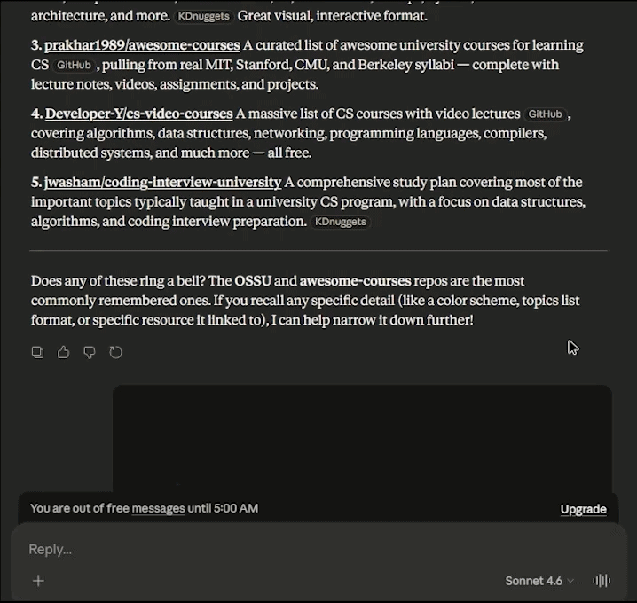

# Claude Branch Chat 🌿

A lightweight Chrome Extension to "branch" your Claude.ai conversations. Seamlessly move context from one chat into a brand-new session with a single click.

---

---
## 🚀 The Problem
Claude conversations can become "heavy" or off-track over time. Sometimes you want to take the current context but start a fresh "branch" to explore a new idea without losing the history. 

## ✨ Features
* **One-Click Branching:** Injects a "Branch here" button into every Claude response.
* **Automatic Context:** Scrapes the conversation history up to your clicked point.
* **Clipboard & Auto-Fill:** Copies the history as clean Markdown and automatically pastes it into the new chat window.
* **Clean UI:** Minimalist design that matches the Claude interface.

## 🛠 Installation (Manual)
Since this is a developer tool, install it via Chrome's Developer Mode:

1.  **Download/Clone** this repository to your local machine.
2.  Open Chrome and navigate to `chrome://extensions/`.
3.  Enable **"Developer mode"** in the top right corner.
4.  Click **"Load unpacked"**.
5.  Select the folder containing the extension files.

## 📖 Usage
1.  Open any chat on [claude.ai](https://claude.ai).
2.  Hover over a message to see the **Branch here** button.
3.  Click it. A new tab will open with your context pre-filled.
4.  Press **Enter** to start your new branch!

_Disclaimer: This project is an independent tool and is not affiliated with, or endorsed by, Anthropic._
_All processing happens locally in your browser; no data is sent to external servers._
